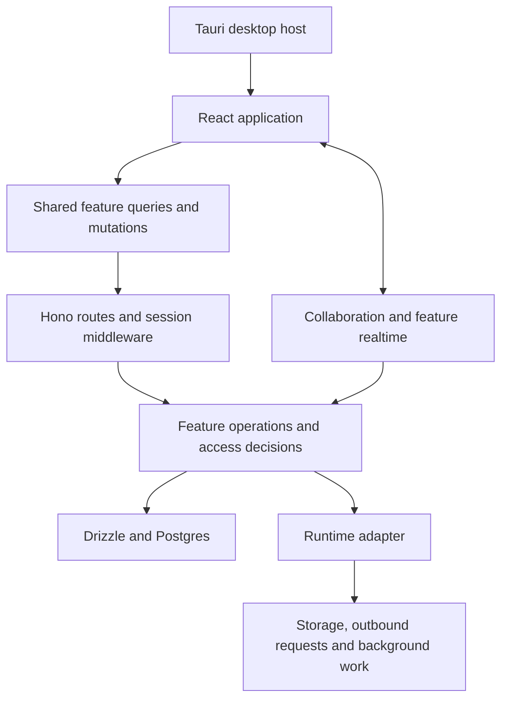

# System overview

Zilobase is a workspace application built around pages, structured databases,
and collaborative editing. This repository contains the React web application,
Hono server, Tauri desktop host, and shared TypeScript packages. Optional
integrations consume only published interfaces.

The web [composition root](../apps/web/src/app) selects providers, routes and edition behavior. [Server composition](../apps/server/src/app/index.ts) installs middleware and mounts [feature routes](../apps/server/src/app/routes.ts). Session authentication identifies the caller; feature authorization determines which operations that caller may perform. Authentication alone does not grant access to every page in a workspace.

[Database context](../apps/server/src/infrastructure/database/index.ts) scopes Drizzle access to a request or explicit background invocation. Streaming work needs an independent context when it outlives request middleware. [Runtime context](../packages/runtime-adapter/src/context.ts) supplies runtime-dependent capabilities; its scoped adapter takes precedence over the process fallback.

Realtime is not a single protocol: page collaboration uses Yjs/Hocuspocus, while database, navigation and mail modules have their own events and recovery. Durable background records and outboxes coordinate work whose lifetime exceeds an HTTP request.

Start with the [repository map](repository-map.md), then follow a [feature guide](README.md). Setup commands and operational procedures remain in the linked runbooks.
