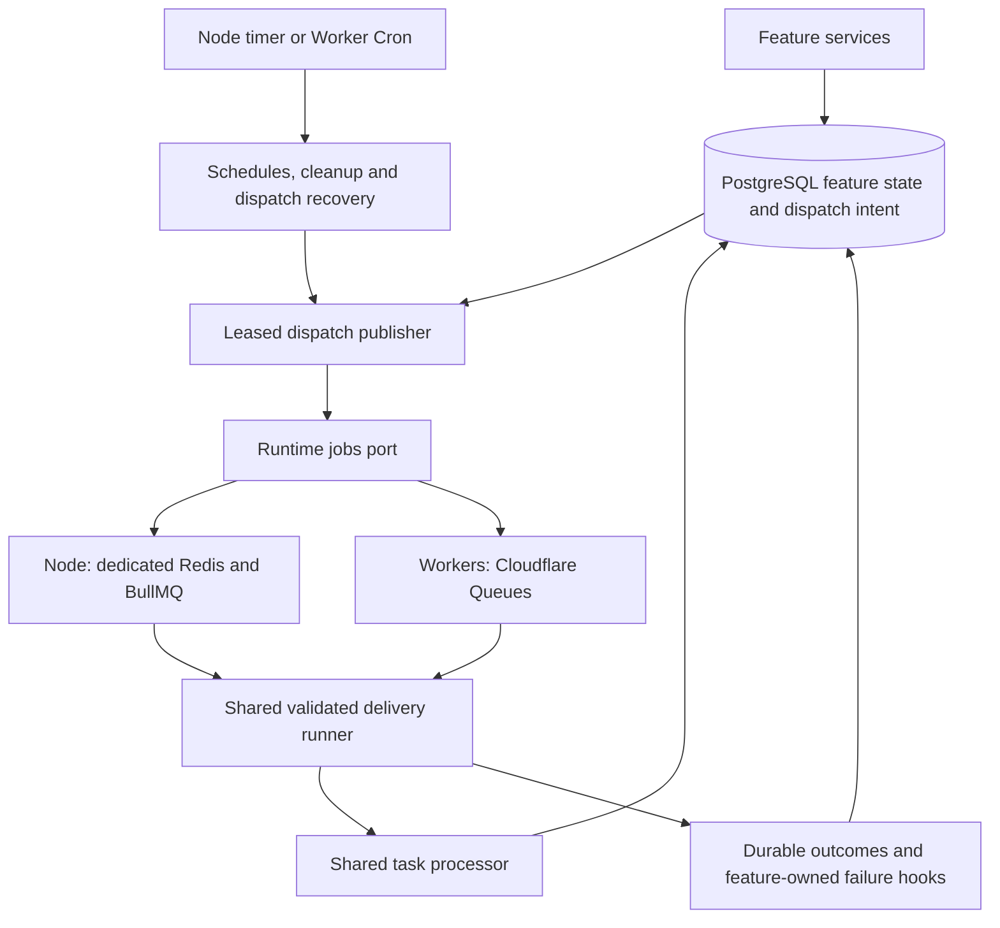

# Background queue adapter candidate verification

Candidate branch: `codex/background-queue-adapters`, created from the current
`codex/shared-client-cache` tip. The shared-cache implementation remains included.
Cloudflare changes use the same branch name in the adjacent adapter repository.
Identity source and schema are unchanged.

## Implemented ownership

- Feature producers commit dispatch intent with durable work. All seven kinds
  enter the same processor; the provider owns transport rather than business state.
- Partial publication, duplicate delivery, crashes and broker retention expiry
  preserve stable dispatch IDs and PostgreSQL delivery authority.
- Business retries create new occurrences; unexpected exceptions use transport
  retries. Exhaustion waits for live ownership to expire before feature failure
  finalization. Explicit replay checks business eligibility and uncertain writes.
- The former Node PostgreSQL coordinator, LISTEN/NOTIFY wakeups, lane timers and
  public direct-drain runtime entrypoints are removed. Calendar recovery queues
  references; watch renewal and revision-notification housekeeping stay maintenance.
- Node requires separate queue Redis in all roles. BullMQ dependencies remain
  confined to Node code. Cloudflare queue/DLQ consumer settings are preserved;
  four additional DLQ consumers persist exhaustion.
- Cutover preview/apply is explicitly scoped. Legacy feature tables lack cell
  IDs, so apply requires a cell-isolated database/schema and stopped runtimes.
  Foreign-cell dispatches and newer unfinished work cause refusal.

Canonical implementation and debugging entrypoints are linked from
[background architecture](../../architecture/platform/background-work.md) and
[the operator runbook](../background-queues.md).

## Executed acceptance

| Gate                             | Evidence                                                                                                                                                                                                                                                                                            |
| -------------------------------- | --------------------------------------------------------------------------------------------------------------------------------------------------------------------------------------------------------------------------------------------------------------------------------------------------- |
| Disposable PostgreSQL and BullMQ | Combined `test:background:isolated` passed; migrations, rollback, nested transactions, failed/partial enqueue recovery, competing publication, future horizon, duplicate effects, business retries and terminal outcomes                                                                            |
| Production task processor        | All seven kinds executed with real SQL/BullMQ; two consumers; automation notifications, AI compaction, encrypted agent checkpoints, two-page Calendar continuation and mutation-journal fanout                                                                                                      |
| Broker/process faults            | Real broker paused during enqueue, restarted during an active handler and restarted with retained work; unavailable startup bounded; graceful active-work shutdown; SIGKILL child recovered after dispatch lease expiry and BullMQ stalled-job recovery                                             |
| Cell and operator behavior       | Purging one cell preserves another queue and unrelated Redis keys; fixed-cutoff cutover repeatability; completed history, credentials, configurations and journals preserved; pending approvals/runs cancelled; schedules advanced; partial cursors invalidated; uncertain/completed replay refused |
| Worker transport                 | Wrangler dry-run bundle executed in Miniflare with real queue producers/consumers and PostgreSQL; admission, duplicate AI execution, durable business rescheduling and DLQ feature finalization passed                                                                                              |
| Worker conformance               | Core Miniflare suite: 38 tests passed, covering seven kinds, lane/cell rejection, acknowledgements, retries and final-attempt/DLQ failure recording                                                                                                                                                 |
| Application                      | Two independent mounted browser clients; committed database socket delivery, acknowledgements, reconnect, seven layouts, shared cache references, rejected-write rollback and Yjs body collaboration passed                                                                                         |
| Domain PostgreSQL suites         | Isolated database controller acceptance and 12 enabled Calendar integration tests passed                                                                                                                                                                                                            |
| Runtime/package checks           | Runtime adapter suite: 118 tests passed; hosted unit suite: 67 passed, one existing skipped; hosted Worker suite: 14 passed; core/hosted typechecks and builds passed                                                                                                                               |
| Deployment configuration         | Development and production Compose config passed using fixture values; Helm lint/template passed; a shared queue/realtime Secret render was correctly refused                                                                                                                                       |

External model and Google HTTP are controlled provider fixtures. SQL, brokers,
leases, checkpoints, consumers and mounted application behavior are real. No
live OAuth account or paid model was used. The Miniflare prerelease fixture loads
the generated bundle as source because its file-loading path fails at startup.
The hosted background dry-run bundle also built successfully, with no BullMQ or
ioredis imports in the Worker output. Dry-run compilation does not deploy.

## Browser measurement

One disposable development run, sampled October 6, 2026:

| Measurement                                                     |                 Observed |
| --------------------------------------------------------------- | -----------------------: |
| Startup to signed-in loaded surface                             |                 4,172 ms |
| Captured HTTP requests across the fixture                       |                       97 |
| Captured response body bytes                                    |                   42,296 |
| Retained JS heap before mount cycles, after forced GC           |         94,954,936 bytes |
| Retained JS heap after mount cycles, after forced GC            |         95,251,640 bytes |
| Retained Query entries before/after cycles                      |                  31 / 31 |
| Shared page / record / definition / value entities before/after | 3 / 3 / 2 / 4, unchanged |

These are development observations, not a production capacity benchmark or
statistical regression claim. Ordinary title, definition and cell changes issued
one write and no blanket reads, and reached the independent mounted consumer.
The queue migration does not change TanStack DB ownership or Yjs storage.

## Release handoff

1. Provision persistent queue Redis with AOF and `noeviction`, distinct from
   realtime Redis. Configure `QUEUE_REDIS_URL` for every Node role; Helm uses a
   separate queue Secret and egress rule. Preserve the four Worker queues and DLQs.
2. Stop producers, consumers and all scheduled maintenance. Confirm old handlers
   have terminated before choosing the fixed UTC cutoff.
3. Apply core migrations 0108–0110 while the affected deployment remains stopped.
   Use the explicit-cell cutover preview, verify storage isolation and counts,
   then apply the same cutoff with the required stopped/isolated flags.
4. The operator cancels unfinished jobs/runs/approvals, clears legacy delivery
   state, purges only the cell's broker queues, advances schedules without
   backfill and invalidates abandoned Calendar cursors. If interrupted, keep the
   deployment stopped and repeat the exact cutoff. Completed effects are retained.
5. Ship matching core/runtime/Cloudflare code together. V1 envelopes and the old
   coordinator API have no compatibility fallback. Start API and worker roles,
   verify `/ready`, `/metrics`, maintenance freshness and fresh queued execution.
6. Reconcile Cloudflare Durable Object migration history against the actually
   applied deployment before release. Existing declarations, class exports and
   migration history were preserved; this change does not execute or authorize
   migration-history cleanup.
7. Verify a fresh database write reaches a second client, then notifications,
   Calendar continuation and AI/agent jobs. Inspect durable exhaustion; replay
   only eligible work through the CLI. Review uncertain writes manually.

No deployment, production reset, broker purge against a deployed cell, identity
schema change or new AI capability was performed. Disposable containers were
removed; existing development services and their data were retained.

## Final candidate gates

`npm run verify:core` passed, including formatting, token alignment, tooling,
community boundaries, all workspace typechecks, feature/package and web tests,
production builds, complete server coverage and query-regression checks.
`npm run test:architecture` passed local links, published exports and runtime-port
boundaries. UI lint completed successfully with existing warnings. Hosted build,
unit tests and Worker tests passed. Both implementation branches were clean after
the final documentation commit; no task-owned disposable services remained.
